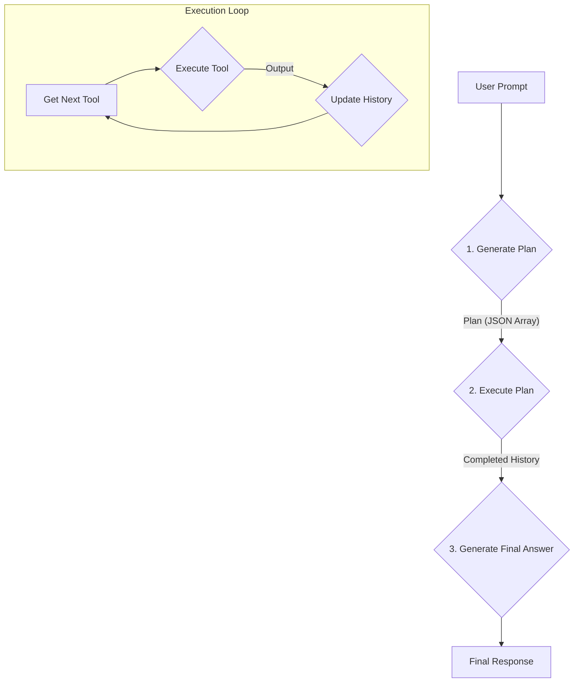

# Plan: Hybrid Tool-Calling Strategy

The goal is to create a more robust agent that can reason about multi-step tasks, execute a sequence of tools, and handle intermediate results. This will be achieved by splitting the agent's process into two main phases: **Planning** and **Execution**.

### Phase 1: Planning

The first step is to have the LLM generate a plan of action. Instead of asking for a single tool call, we will prompt the model to produce a JSON array of tool calls that represent the steps needed to accomplish the user's goal.

1.  **Modify the System Prompt:**
    The `build_system_prompt` function in `agent/agent.py` will be updated to instruct the model to return a `plan` consisting of a list of tool calls.

2.  **Create a `generate_plan` Function:**
    A new function, `generate_plan(prompt)`, will be added to `agent/agent.py`. This function will use the modified system prompt to call the LLM and parse its output, returning a list of tool calls (e.g., `[{"tool": "find_path", "args": {"name": "ComfyUI"}}, {"tool": "list_directory", "args": {"path": "$1.output"}}]`). The `$1.output` syntax indicates that the input for the second tool comes from the output of the first.

### Phase 2: Execution

Once the plan is generated, the agent will execute it step-by-step, feeding the output of one tool into the input of the next, similar to a ReAct loop.

1.  **Update `run_single_prompt`:**
    The main `run_single_prompt` function in `agent/agent.py` will be refactored to orchestrate the new workflow:
    a.  Call `generate_plan()` with the user's initial prompt.
    b.  Iterate through the tool calls in the generated plan.
    c.  For each tool call, substitute any placeholder arguments (like `$1.output`) with the actual output from the previous step.
    d.  Execute the tool and append the result to the conversation history.
    e.  If a tool fails, the loop will terminate, and the error will be reported.

2.  **Final Response Generation:**
    After all tools in the plan have been executed successfully, the agent will make one final call to the LLM. It will provide the complete conversation history, including all tool outputs, and ask for a final, user-friendly answer.

### Implementation Diagram

### Code Changes

*   **`agent/agent.py`**: This file will see the most changes. The `run_single_prompt` function will be rewritten to implement the Plan and Execute loop. A new `generate_plan` function will be added.
*   **`run_remote.py`**: No changes are expected here, as it simply acts as an entry point.
*   **`tools/tool_base.py`**: No changes are expected here, as the existing tool registration and calling mechanism can be reused.

This hybrid approach provides the best of both worlds: the structure of an upfront plan and the flexibility of a step-by-step execution model, allowing the agent to handle more complex, multi-tool tasks effectively.